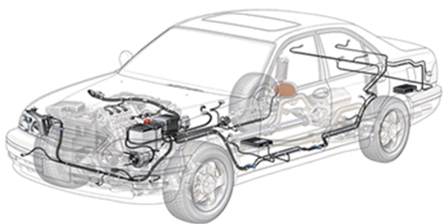
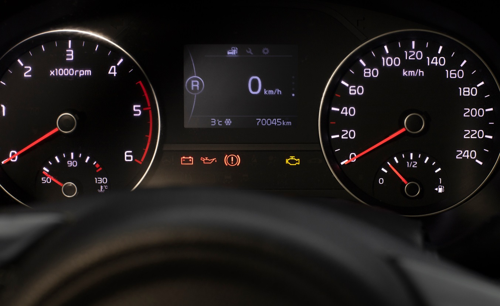

# Trabalho 2

Curso de Especialização em Sistemas Automotivos - Software
Disciplina de Padrão POSIX

## 1. Objetivos

Este trabalho tem por objetivo aplicar os conceitos de sistemas embarcados a um sistema de controle automotivo. Serão explorados os conceitos de entradas e saídas digitais via GPIO, eventos, controle de interrupções, threads, PWM.

Sistema Elétrico | Rotação do Motor  |  Painel do Carro
:-------------------------:|:-------------------------:|:-------------------------:
 |  | 

O trabalho envolve o desenvolvimento do software que efetua o controle de partes do sistema elétrico e acionamento do motor de um automóvel. O sistema deve ser capaz de movimentar o carro através do controle do acelerador e freio, medir a rotação do motor bem como a velocidade do carro, controlar o acionamento do sistema elétrico incluindo faróis e setas de direção bem como implementar o controle de velocidade (cruise control).

O controle do carro deve responder aos comandos dos usuários por meio de botões do painel e dos pedais de aceleração e freio.

**Comandos de Entrada do Sistema**
- Pedal de Acelerador
- Pedal de Freio
- Acionamento de Farol
- Acionamento da Seta Equerda  
- Acionamento da Seta Direita  

**Comandos do Controle de Velocidade**
- SET (Configurar Velocidade)
- CANCEL (Cancelar o controle de velocidade)

## 2. Componentes do Sistema

O simulador do sistema do carro é composto por:
- 01 Motor;
- 01 Driver de potência para acionamento do motor;
- 01 Sensor de efeito Hall para rotação da roda;
- 01 Sensor de efeito Hall para rotação do motor;
- 01 Raspberry Pi 4.

## 3. Conexões entre os módulos do sistema

A Figura 1 ilustra os componentes do sistema:

Figura 1 - Diagrama esquemático de conexões entre módulos

 

Detalhes das conexões entre os módulos:

1. Os sensores de efeito Hall de rotação do motor e roda estão ligados diretamente à portas da GPIO (Vide Tabela 1);  
2. O motor e os pinos de direção estão ambos ligados às portas GPIO e são acionados através do circuito de potência (Vide Tabela 1);   
3. Os pedais do Acelerador e Freio estão conectados à GPIO (Vide Tabela 1);  

 

Tabela 1 - Pinos da GPIO (BCM) Raspberry Pi

| Entrada / Saída | GPIO (BCM) | Direção |
|:--|:-:|:-:|
| `Motor_DIR1` - Direção 1                                | 17 | OUT |  
| `Motor_DIR2` - Direção 2                                | 18 | OUT |  
| `Motor_POT` - Potência do Motor (PWM)             | 23 | OUT |  
| `Freio_INT` - Intensidade do Pedal de Freio (PWM) | 24 | OUT |  
| `Pedal_AC` - Pedal do Acelerador                  | 27 | IN  |  
| `Pedal_FR` - Pedal do Freio                       | 22 | IN  |  
| `Sensor_hall_motor` - Sensor Hall Motor           | 11 | IN  |  
| `Sensor_hall_roda_A`  - Sensor Hall Roda            | 5 | IN  |  
| `Sensor_hall_roda_B`  - Sensor Hall Roda            | 6 | IN  |  
| `Farol_Baixo` - Luzes de Farol Baixo              | 19 | OUT |  
| `Farol_Alto` - Luzes de Farol Alto                | 26 | OUT |  
| `Luz_Freio` - Luzes de Freio                      | 25 | OUT |  
| `Luz_Seta_Esq` - Luz da seta esquerda             |  8 | OUT |  
| `Luz_Seta_Dir` - Luz da seta direita              |  7 | OUT |  
| `Luz_Temp_Motor` - Luz de alerta da temepratura do motor  | 12 | OUT |  
| `Comando_Farol` - Comando de ligar/desligar farol  | 16 | IN |  
| `Comando_seta_esq` - Comando de ligar/desligar seta esquerda  | 20 | IN |  
| `Comando_seta_dir` - Comando de ligar/desligar seta direita  | 21 | IN |  
| `CC_RES` - Comando de Cruise Control  | 13 | IN |  
| `CC_CANCEL` - Comando de Cancelar Cruise Control  | 0 | IN |  

 
 

## 4. Requisitos

Os sistema de controle possui os seguintes requisitos:
1. **Programação**:   
   1.1 O código deve ser desenvolvido em C;  
   1.2. Na implementação do software, não podem haver loops infinitos que ocupem 100% da CPU;  
2. **Controle do Motor**:  
   2.1 O sistema deve implementar o controle de velocidade do carro utilizando controle ON/OFF simples atuando sobre o Motor utilizando a técnica de PWM;  
   2.2 Do mesmo modo, o freio do carro pode ser acionado via PWM;  
   2.3 A velocidade do carro pode ser controlada de dois modos:  
      - Pelo acionamento manual dos pedais de acelerador e freio;  
      - De modo automático via acionamento do *Cruise Control*;  
3. **Entradas Digitais**:  
   3.1 As entradas digitais diretamente conectadas à Raspberry Pi são: pedais do acelerador e freio, sensores de efeito hall para medir rotação do motor e velocidade da roda;  
   3.2 **Sensor hall motor**: o sensor que mede a rotação do motor está ligado diretamente a uma porta da GPIO (Vide Tabela 1) e mede frequências de até 7000 RPM sendo que **cada pulso do sensor corresponde a uma volta do motor**;  
   3.3 **Sensor hall roda**: o sensor que mede a velocidade angular da roda funciona com um par de sinais ligados à GPIO (A e B). O sensor emite **um pulso a cada 360˚** de rotação da roda. O canal A está defasado de 90˚ do canal B. Neste sentido, caso o pulso do canal A seja iniciado primeiro, seguido do pulso do canal B, a roda gira em sentido horário (carro andando para frente), caso contrário, a roda estará girando em sentido anti-horário (carro andando de ré).  
4. **Saídas Digitais**:  
   4.1 As saídas digitais diretamente conectadas à Raspberry Pi são: faróis (baixo e alto), luz de freio e luz de alerta de temperatura do motor;    
5. **Painel do Carro**:  
   5.1 O painel do carro possui um conjunto de entradas e saídas e deve ser implementado via terminal.
   
   5.2 Os comandos são:  
      - Cruise control: 
         - `RES`: O botão **Resume** aciona o sistema de controle de velocidade utilizando a velocidade atual do carro como referência;  
         - `CANCEL`: O botão **cancel** desativa o sistema de controle de velocidade;  
         - `Set +`: este botão incrementa a velocidade desejada (`set point`) em + 1 km/h;  
         - `Set -`; este botão reduz a velocidade desejada (`set point`) em - 1 km/h;   
      - Setas: `Equerda`, `Direita`: ao pressionar, ativa a seta que deve piscar de modo intermitente uma vez por segundo e deve ser desativada quando o botão é pressionado pela segunda vez.  
   
   5.3 As informações indicação do painel incluem:  
      - Velocidade do carro (km/h);  
      - Rotação do Motor (RPM);  
      - Distância percorrida (km);  
      - Configuração do Cruise Control (Ligado/Desligado) e Velocidade;  
      - Estado do Farol (Baixo ou Alto);  
      - Setas (Esquerda / Direita) piscando a cada 1 segundo quando acionadas;  
       
7.  O programa deve tratar a interrupção do teclado (Ctrl + C = sinal **SIGINT**) encerrando todas as comunicações com periféricos (UART / I2C / GPIO) e desligar os atuadores (PWM do Motor);
8. O código em C deve possuir Makefile para compilação.
10. O sistema deve conter em seu README as instruções de compilação/execução e uso.

### Links dos Dashboards

<!-- [Carro 1]()   -->

<!-- ## 6. Parâmetros de PID

Para o uso do controle do PID, estão sendo sugeridos os seguintes valores para as constantes:
- **Kp** = 0.5
- **Ki** = 0.05
- **Kd** = 40.0

Porém, vocês estão livres para testar outros valores que sejam mais adequados. -->

### Acionamento do Motor 

O **motor** deve ser acionado utilizando a técnica de PWM (sugestão de uso da biblioteca WiringPi / SoftPWM). A intensidade de acionamento do motor por variar entre 0 e 100%.
**PWM**: o comando de **PWM** deve ser acionado com **frequência de 1 kHz**.

Direção do Motor:

| Ação | Dir1 | Dir2 |
|:--|:-:|:-:|
| **Livre**  | 0 | 0 |  
| **Andar para Frente** | 1 | 0 |  
| **Andar de marcha ré**  | 0 | 1 |  
| **Freio** | 1 | 1 |  

## 7. Critérios de Avaliação

### Entrega:
<!-- 
- Repositório (no Github Classroom) incluindo o README com as instruções de execução (Para projetos em C/C++ é necessário incluir o Makefile);  
- Vídeo com duração entre 5 min e 10 min mostrando o sistema em funcionamento (Mostrando o funcionamento em si e destacar partes do código fonte mais importantes).   -->

<!-- A avaliação será realizada seguindo os seguintes critérios:

|   ITEM    |   COMENTÁRIO  |   VALOR   |
|------------------------|---------------------------------------------------------------------------------------------------------|---------|
|**Implementação do controlador PID** | Correta implementação do controlador PID (motor PWM), incluindo a leitura do encoder e acionamento da direção dos motores, correto posicionamento dos elevadores nos andares (ao parar no andar, o sinal do sensor do andar deve acender). |    2,0 |
|**Menu de controle**        | Correta leitura e acionamento de eventos baseados nos comandos dos usuários por meio dos botões no dashboard. | 1,5 |
|**Leitura da Temperatura Ambiente**| Leitura dos valores de Temperatura Ambiente (Sensor BMP280). | 0,5 |
|**Comunicação UART** | Leitura do encoder, botões e envio de temperatura e do sinal de controle através da comunicação MODBUS-UART. | 2,0 |
|**Mostrador no LCD**        | Apresentação do funcionamento do elecador menu no LCD incluindo o estado atual e a temperatura ambiente. | 1,0 |
|**Qualidade do Código**     | Utilização de boas práticas como o uso de bons nomes, modularização e organização em geral.    |  2,0 |
|**README com Experimento** | Documentação README com instruçoes de compilação, de uso e relatório do experimento com o gráfico e vídeo. |  1,0 |
|**Pontuação Extra**         |   Qualidade e usabilidade acima da média.  |  0,5   | -->

## 8. Referências

[Controle Liga/Desliga - Wikipedia](https://pt.wikipedia.org/wiki/Controle_liga-desliga)  
[Controle PID - Wikipedia](https://pt.wikipedia.org/wiki/Controlador_proporcional_integral_derivativo)  
[Driver da Bosh para o sensor BMP280](https://github.com/BoschSensortec/BMP2-Sensor-API/)  
[Biblioteca BCM2835 - GPIO](http://www.airspayce.com/mikem/bcm2835/)  
[Controle do OLED 128x64 Python](https://www.instructables.com/Raspberry-Pi-Monitoring-System-Via-OLED-Display-Mo/)
[Controle do OLED 128x64 C/C++](https://github.com/gavinlyonsrepo/SSD1306_OLED_RPI)  
[Biblioteca WiringPi GPIO](http://wiringpi.com)  
[PWM via WiringPi](https://www.electronicwings.com/raspberry-pi/raspberry-pi-pwm-generation-using-python-and-c)

